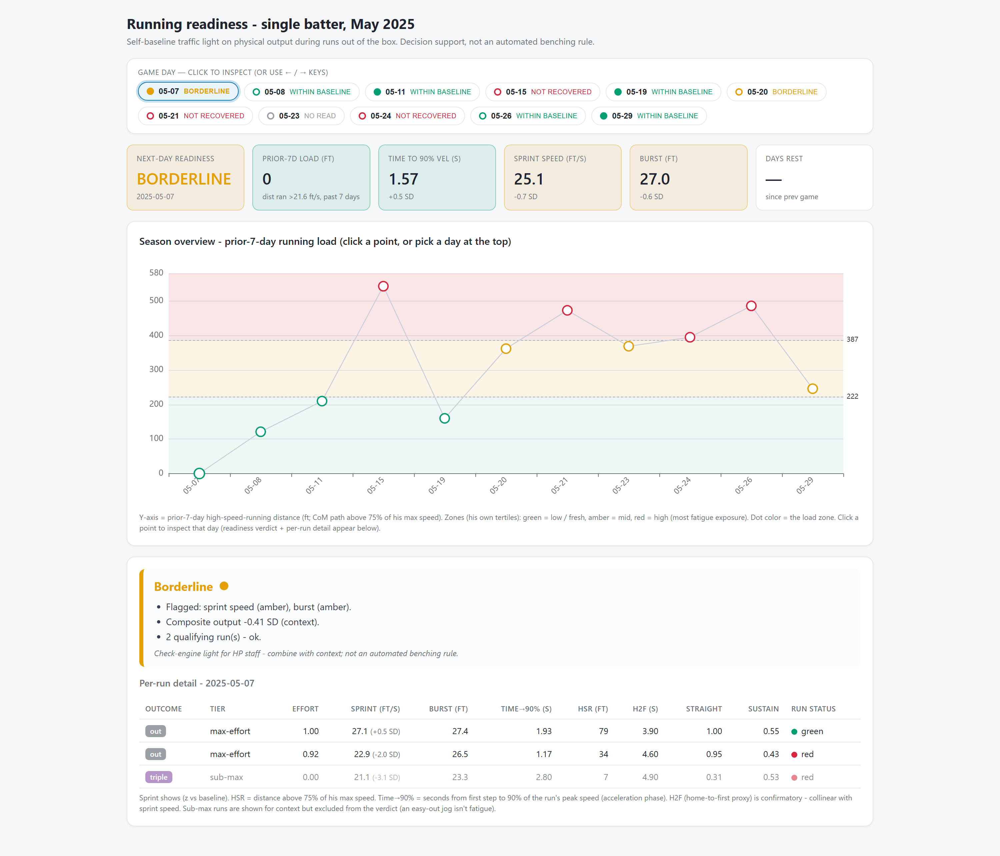

# MLB Sprint Quality Analysis

Converts in-game Hawk-Eye tracking (3D markerless motion capture, 30 Hz) into
sprint-quality features &mdash; peak speed, burst, and high-speed running distance &mdash;
via zero-lag Butterworth filtering and Statcast definitions. Clustering separates max-effort sprints
from context-driven jogs, so day-to-day decline is scored against the player's own
effort-weighted baseline instead of the game situation.

**[Interactive dashboard](https://1raync.github.io/MLB-SprintQuality-Dashboard/figures/readiness_dashboard.html)** &middot; **[Methodology writeup](README.pdf)**

`load_data.py` &rarr; `run_features.py` &rarr; `cluster_runs.py` &rarr; `readiness.py` &rarr; `build_dashboard.py`

The source dataset is proprietary and not included, so the scripts won't run
end-to-end from a clone. The committed outputs in `figures/` and the CSVs are what
they produce.
